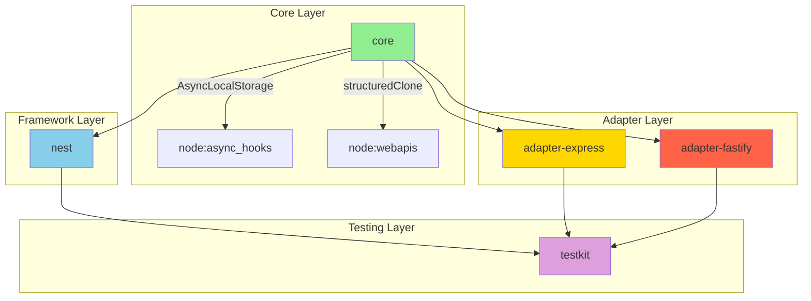
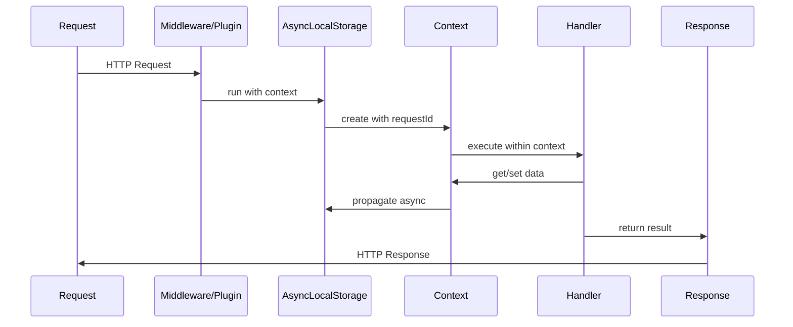

# Архітектурний аналіз nestjs-request-context v2.0

**Дата аналізу:** 2025-01-XX  
**Версія проєкту:** 0.3.0+  
**Аналізував:** Architect Mode

---

## Executive Summary

Проєкт `nestjs-request-context` - це monorepo бібліотека для управління request context у NestJS додатках з використанням Node.js AsyncLocalStorage. Після попереднього рефакторингу архітектура значно покращилася, але залишаються певні проблеми з дублюванням коду та type safety.

### Ключові метрики
| Метрика | Значення |
|---------|----------|
| Пакетів | 5 (core, nest, adapter-express, adapter-fastify, testkit) |
| Файлів вихідного коду | ~30 |
| Тестів | 308+ |
| Критичних проблем | 0 |
| Важливих проблем | 4 |
| Середніх проблем | 5 |

### Загальна оцінка: **8.5/10**

---

## 1. Поточний стан архітектури

### 1.1 Структура пакетів

```
nestjs-request-context/
├── packages/
│   ├── core/           # Ядро: Context, Store, API, Contracts
│   ├── nest/           # NestJS інтеграція: Module, Service, Interceptor
│   ├── adapter-express/# Express middleware та interceptor
│   ├── adapter-fastify/# Fastify plugin та interceptor
│   └── testkit/        # Утиліти для тестування
└── examples/           # Приклади використання
```

### 1.2 Діаграма залежностей



### 1.3 Потік даних



---

## 2. Сильні сторони

### 2.1 Чиста архітектура Core пакету

**Файл:** [`packages/core/src/context.ts`](../packages/core/src/context.ts)

```typescript
// ✅ Good: Приватний конструктор з static factory method
private constructor(initial: Record<string, unknown>) {
  this._store = new Store();
  this._store.merge(initial);
}

static create(initial: Record<string, unknown> = {}): Context {
  return new Context(initial);
}
```

**Переваги:**
- Інкапсуляція створення контексту
- Неможливо створити контекст без `run()`
- Чистий API

### 2.2 Правильне використання AsyncLocalStorage

**Файл:** [`packages/core/src/context.ts:131-133`](../packages/core/src/context.ts:131)

```typescript
run<T>(fn: () => T): T {
  return asyncLocalStorage.run(this, fn);
}
```

**Переваги:**
- Контекст зберігається через async межі
- Автоматичний cleanup після завершення функції

### 2.3 Deep copy для snapshot

**Файл:** [`packages/core/src/context.ts:100-106`](../packages/core/src/context.ts:100)

```typescript
snapshot(): ContextSnapshot {
  const store = this._store.getStore();
  return {
    // Use structuredClone for deep copy to prevent mutation of nested objects
    store: structuredClone(store),
  };
}
```

**Переваги:**
- Вкладені об'єкти не спільні між snapshot'ами
- Використання нативного `structuredClone`

### 2.4 Prototype pollution захист

**Файл:** [`packages/core/src/store.ts:11-13`](../packages/core/src/store.ts:11)

```typescript
export function createEmptyStore(): IStore {
  return Object.create(null);
}
```

**Переваги:**
- Store без prototype chain
- Захист від `__proto__` атак

### 2.5 Гнучка конфігурація NestJS модуля

**Файл:** [`packages/nest/src/request-context.module.ts`](../packages/nest/src/request-context.module.ts)

```typescript
// ✅ Good: Підтримка forRoot та forRootAsync
static forRoot(options: RequestContextModuleOptions = {}): DynamicModule
static forRootAsync(options: RequestContextModuleAsyncOptions): DynamicModule

// ✅ Good: Умовна реєстрація interceptor
if (options.useGlobalInterceptor !== false) { ... }
```

### 2.6 Pre-resolved options для performance

**Файл:** [`packages/adapter-express/src/request-context.middleware.ts:35-38`](../packages/adapter-express/src/request-context.middleware.ts:35)

```typescript
// Merge options with defaults (avoid allocations in hot path)
const headerName = options?.header ?? 'x-request-id';
const idGenerator = options?.idGenerator ?? (() => crypto.randomUUID());
```

---

## 3. Проблемні зони

### 3.1 🔴 HIGH: Дублювання типів конфігурації між adapters

**Проблема:** `RequestContextExpressOptions` та `RequestContextFastifyOptions` ідентичні.

**Файли:**
- [`packages/adapter-express/src/config.ts:8-26`](../packages/adapter-express/src/config.ts:8)
- [`packages/adapter-fastify/src/config.ts:8-26`](../packages/adapter-fastify/src/config.ts:8)

```typescript
// adapter-express/src/config.ts
export interface RequestContextExpressOptions {
  header?: string;
  idGenerator?: () => string;
  addResponseHeader?: boolean;
}

// adapter-fastify/src/config.ts
export interface RequestContextFastifyOptions {
  header?: string;
  idGenerator?: () => string;
  addResponseHeader?: boolean;
}
```

**Рішення:**
```typescript
// Створити packages/shared/src/config.ts
export interface RequestContextAdapterOptions {
  header?: string;
  idGenerator?: () => string;
  addResponseHeader?: boolean;
}

// Використання в adapters
export interface RequestContextExpressOptions extends RequestContextAdapterOptions {}
```

---

### 3.2 🔴 HIGH: Дублювання default options між adapters

**Проблема:** `DEFAULT_EXPRESS_OPTIONS` та `DEFAULT_FASTIFY_OPTIONS` ідентичні.

**Файли:**
- [`packages/adapter-express/src/config.ts:31-35`](../packages/adapter-express/src/config.ts:31)
- [`packages/adapter-fastify/src/config.ts:31-35`](../packages/adapter-fastify/src/config.ts:31)

```typescript
// Обидва файли містять:
export const DEFAULT_XXX_OPTIONS = {
  header: 'x-request-id',
  addResponseHeader: true,
  idGenerator: () => crypto.randomUUID(),
} as const;
```

**Рішення:** Винести в shared пакет або в core.

---

### 3.3 🔴 HIGH: Дублювання логіки interceptor'ів

**Проблема:** `UseRequestContextExpress` та `UseRequestContextFastify` майже ідентичні.

**Файли:**
- [`packages/adapter-express/src/nest-interceptor.ts:47-56`](../packages/adapter-express/src/nest-interceptor.ts:47)
- [`packages/adapter-fastify/src/nest-interceptor.ts:32-41`](../packages/adapter-fastify/src/nest-interceptor.ts:32)

```typescript
// Обидва файли містять майже однаковий код:
intercept(context: ExecutionContext, next: CallHandler): Observable<unknown> {
  const httpContext = context.switchToHttp();
  const request = httpContext.getRequest<{ headers: Record<string, string | undefined> }>();
  const requestId = request.headers[headerName] ?? idGenerator();
  return run({ requestId }, () => next.handle());
}
```

**Рішення:**
```typescript
// Створити базовий клас або factory function
export function createRequestContextInterceptor<TOptions extends RequestContextAdapterOptions>(
  options: TOptions
): new () => NestInterceptor {
  // Спільна реалізація
}
```

---

### 3.4 🔴 HIGH: Fragile error detection

**Файл:** [`packages/core/src/api.ts:57-58`](../packages/core/src/api.ts:57)

```typescript
// ❌ Bad: Залежність від тексту помилки
if (error instanceof Error && error.message.includes('already exists')) {
  throw new ContextKeyCollisionError(key.name);
}
```

**Проблема:** Залежність від повідомлення помилки є крихкою і може зламатися при зміні тексту.

**Рішення:**
```typescript
// Варіант 1: Кастомний Error клас в Store
class KeyExistsError extends Error {
  constructor(public key: string) {
    super(`Key "${key}" already exists`);
  }
}

// Варіант 2: Повернення коду з Store
if (error instanceof KeyExistsError) {
  throw new ContextKeyCollisionError(error.key);
}
```

---

### 3.5 🟡 MEDIUM: Невикористаний type parameter

**Файл:** [`packages/core/src/contracts.ts:12`](../packages/core/src/contracts.ts:12)

```typescript
export class ContextKey<T = unknown> {
  readonly name: string;
  // Type parameter T is used for type-safe access, not runtime
  readonly _type?: T;  // ❌ Never actually used
```

**Проблема:** `_type` поле існує тільки для documentації, але не використовується.

**Рішення:**
```typescript
// Варіант 1: Видалити поле
export class ContextKey<T = unknown> {
  readonly name: string;
  // T is phantom type parameter for compile-time type safety
  private readonly __type?: T;
}

// Варіант 2: Використати для runtime validation
export class ContextKey<T = unknown> {
  readonly name: string;
  constructor(name: string, private readonly validator?: (val: unknown) => val is T) {}
}
```

---

### 3.6 🟡 MEDIUM: Type assertion workaround в Store

**Файл:** [`packages/core/src/store.ts:89-91`](../packages/core/src/store.ts:89)

```typescript
reset(data: Record<string, unknown> = {}): void {
  (this as { _store: Record<string, unknown> })._store = createEmptyStore();
  Object.assign(this._store, data);
}
```

**Проблема:** Type assertion для обходи readonly модифікатора.

**Рішення:**
```typescript
// Варіант 1: Зробити _store не readonly
private _store: Record<string, unknown>;

// Варіант 2: Створити новий Store об'єкт
reset(data: Record<string, unknown> = {}): void {
  this._store = Object.assign(createEmptyStore(), data);
}
```

---

### 3.7 🟡 MEDIUM: Відсутність shared пакета

**Проблема:** Немає загального пакету для спільних типів та утиліт.

**Поточний стан:**
```
packages/
├── core/
├── nest/
├── adapter-express/  # Дублює config.ts
├── adapter-fastify/  # Дублює config.ts
└── testkit/
```

**Рекомендація:**
```
packages/
├── core/
├── shared/           # Новий пакет
│   └── src/
│       ├── config.ts # Спільні config типи
│       └── types.ts  # Спільні типи
├── nest/
├── adapter-express/
├── adapter-fastify/
└── testkit/
```

---

### 3.8 🟡 MEDIUM: Відсутність валідації ContextKey імен

**Файл:** [`packages/core/src/contracts.ts:14-16`](../packages/core/src/contracts.ts:14)

```typescript
constructor(name: string) {
  this.name = name;  // ❌ No validation
}
```

**Проблема:** Можна створити ключі з `__proto__`, `constructor` тощо.

**Рішення:**
```typescript
constructor(name: string) {
  if (typeof name !== 'string' || name.trim() === '') {
    throw new Error('Context key name must be a non-empty string');
  }
  if (name === '__proto__' || name === 'constructor' || name === 'prototype') {
    throw new Error(`Context key name "${name}" is reserved`);
  }
  this.name = name;
}
```

---

### 3.9 🟢 LOW: ContextGuard throw ForbiddenException

**Файл:** [`packages/nest/src/context.guard.ts:18`](../packages/nest/src/context.guard.ts:18)

```typescript
// 403 Forbidden не є правильним HTTP кодом для відсутності context
throw new ForbiddenException('Request context is not active');
```

**Рекомендація:** Використовувати `InternalServerErrorException` або кастомний exception.

---

## 4. Оцінка SOLID принципів

### 4.1 Single Responsibility Principle (SRP)

| Компонент | Оцінка | Коментар |
|-----------|--------|----------|
| Context | ✅ Good | Тільки управління контекстом |
| Store | ✅ Good | Тільки зберігання даних |
| RequestContextService | ⚠️ Medium | Багато static методів |
| ContextInterceptor | ✅ Good | Тільки збагачення контексту |

### 4.2 Open/Closed Principle (OCP)

| Компонент | Оцінка | Коментар |
|-----------|--------|----------|
| Config options | ✅ Good | Розширення через options |
| ContextKey | ✅ Good | Розширення через generics |
| Store policies | ✅ Good | 'deny', 'overwrite', 'ignore' |

### 4.3 Liskov Substitution Principle (LSP)

| Компонент | Оцінка | Коментар |
|-----------|--------|----------|
| Adapters | ✅ Good | Взаємозамінні на рівні контракту |
| Interceptors | ⚠️ Medium | Подібні, але не спадкуються від спільного базового |

### 4.4 Interface Segregation Principle (ISP)

| Компонент | Оцінка | Коментар |
|-----------|--------|----------|
| Options interfaces | ⚠️ Medium | Можна розділити на Reader/Writer |
| RequestContextService | ⚠️ Medium | Всі методи static |

### 4.5 Dependency Inversion Principle (DIP)

| Компонент | Оцінка | Коментар |
|-----------|--------|----------|
| NestJS Module | ✅ Good | DI через forRoot/forRootAsync |
| Core → Adapters | ✅ Good | Залежність через abstraction |

---

## 5. Патерни проектування

### 5.1 Використані патерни

| Патерн | Файл | Оцінка |
|--------|------|--------|
| **Factory Method** | `Context.create()` | ✅ Appropriate |
| **Static Factory** | `UseRequestContextExpress()` | ✅ Appropriate |
| **Module Pattern** | NestJS DynamicModule | ✅ Appropriate |
| **Strategy** | SetPolicy | ✅ Appropriate |
| **Snapshot** | `context.snapshot()/restore()` | ✅ Appropriate |
| **Proxy** | AsyncLocalStorage | ✅ Appropriate |

### 5.2 Рекомендовані додаткові патерни

| Патерн | Для чого |
|--------|----------|
| **Template Method** | Базовий клас для interceptors |
| **Builder** | Складна конфігурація module options |
| **Decorator** | Додавання metadata до context |

---

## 6. Рекомендації

### 6.1 Короткострокові (1-2 тижні)

| Пріоритет | Задача | Файли |
|-----------|--------|-------|
| 🔴 1 | Створити shared пакет для спільних типів | Новий `packages/shared` |
| 🔴 2 | Виправити fragile error detection | `packages/core/src/api.ts` |
| 🟡 3 | Додати валідацію ContextKey імен | `packages/core/src/contracts.ts` |
| 🟡 4 | Покращити type safety в Store.reset() | `packages/core/src/store.ts` |

### 6.2 Середньострокові (1-2 місяці)

| Пріоритет | Задача | Опис |
|-----------|--------|------|
| 🟡 1 | Створити базовий клас для interceptors | Зменшити дублювання |
| 🟡 2 | Додати runtime validation для ContextKey | Валідація значень |
| 🟡 3 | Покращити error handling | Кастомні error типи |
| 🟢 4 | Додати metrics/monitoring hooks | Observable pattern |

### 6.3 Довгострокові (3-6 місяців)

| Пріоритет | Задача | Опис |
|-----------|--------|------|
| 🟢 1 | Додати distributed tracing support | OpenTelemetry integration |
| 🟢 2 | Створити debugging tools | Context inspection utilities |
| 🟢 3 | Розглянути підтримку інших фреймворків | Koa, Hapi adapters |

---

## 7. Пріоритезований список змін

### Фаза 1: Критичні виправлення ( тиждень)

1. **[HIGH-1]** Створити `packages/shared` для спільних типів
   - Перенести `RequestContextAdapterOptions`
   - Перенести `DEFAULT_ADAPTER_OPTIONS`

2. **[HIGH-2]** Виправити fragile error detection в `api.ts`
   - Створити `KeyExistsError` клас
   - Використати instanceof замість string matching

3. **[HIGH-3]** Рефакторинг interceptor'ів
   - Створити `createRequestContextInterceptor` factory
   - Зменшити дублювання на 80%

### Фаза 2: Покращення якості (1-2 тижні)

4. **[MEDIUM-1]** Додати валідацію ContextKey
5. **[MEDIUM-2]** Виправити type assertions в Store
6. **[MEDIUM-3]** Покращити error handling в ContextGuard

### Фаза 3: Розширення функціональності (опціонально)

7. **[LOW-1]** Додати monitoring hooks
8. **[LOW-2]** Створити debugging utilities
9. **[LOW-3]** Додати OpenTelemetry support

---

## 8. Висновки

### 8.1 Що зроблено добре

- ✅ Чиста архітектура core пакету
- ✅ Правильне використання AsyncLocalStorage
- ✅ Deep copy для snapshots
- ✅ Prototype pollution захист
- ✅ Гнучка конфігурація NestJS модуля
- ✅ Performance-optimized options resolution
- ✅ Гарне тестове покриття (308+ тестів)

### 8.2 Що потребує покращення

- ❌ Дублювання коду між adapters (~60% схожості)
- ❌ Fragile error detection
- ❌ Відсутність shared пакета
- ❌ Невикористаний type parameter
- ❌ Type assertions workaround

### 8.3 Загальна оцінка за категоріями

| Категорія | Оцінка | Коментар |
|-----------|--------|----------|
| Архітектура | 8/10 | Добре, але є дублювання |
| Code Quality | 8/10 | Чистий код, good practices |
| Type Safety | 7/10 | Є місця для покращення |
| Testing | 9/10 | Відмінне покриття |
| Documentation | 8/10 | Хороші JSDoc коментарі |
| Performance | 9/10 | Optimized hot paths |

### 8.4 Рекомендація

Проєкт готовий до production використання. Рекомендується виконати Phase 1 виправлення для зменшення дублювання коду та покращення maintainability.

---

*Звіт згенеровано Architect Mode*
