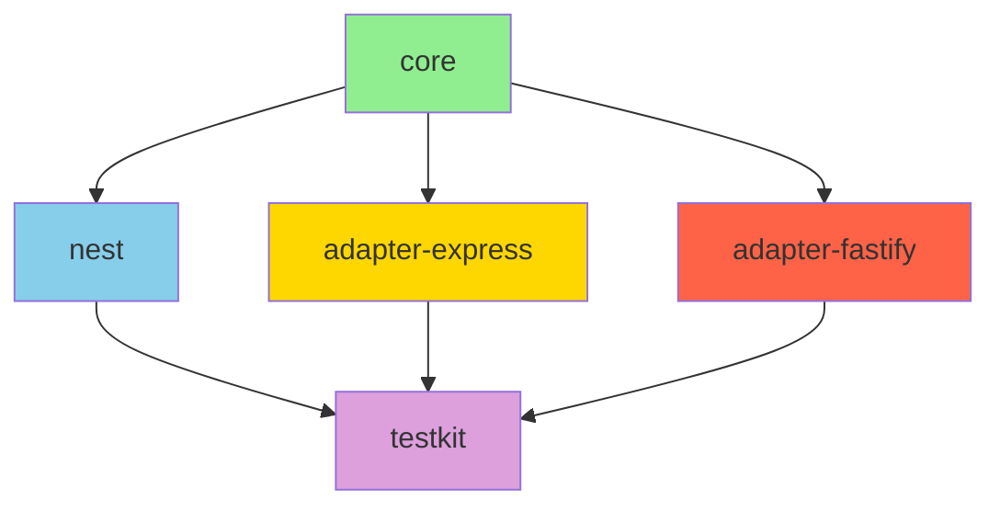

# Глибокий аналіз проєкту nestjs-request-context

**Дата аналізу:** 2025-01-XX  
**Версія проєкту:** 0.3.0  
**Аналізував:** Architect Mode

---

## Executive Summary

Проєкт `nestjs-request-context` - це monorepo бібліотека для управління request context у NestJS додатках з використанням Node.js AsyncLocalStorage. Загалом архітектура проекту добре продумана, але існує **критична проблема з Fastify адаптером**, яка робить його фактично непридатним для використання.

### Ключові метрики
- **Пакетів:** 5 (core, nest, adapter-express, adapter-fastify, testkit)
- **Файлів вихідного коду:** ~30
- **Тестів:** ~60+ unit та e2e тестів
- **Критичних проблем:** 3
- **Важливих проблем:** 6
- **Середніх проблем:** 5

---

## 1. Критичні проблеми (CRITICAL)

### 🔴 CRITICAL-1: Fastify Plugin не працює з AsyncLocalStorage

**Файл:** [`packages/adapter-fastify/src/fastify-request-context.plugin.ts:47-51`](../packages/adapter-fastify/src/fastify-request-context.plugin.ts:47)

**Опис:**
```typescript
return run({ requestId }, async () => {
  // Context is active, but will be lost when this function completes
  // We cannot directly wrap route handler from here
  // This is a known limitation with Fastify hooks and AsyncLocalStorage
});
```

Проблема в тому, що Fastify hooks не дозволяють обгорнути весь lifecycle запиту в AsyncLocalStorage контекст. Функція `run()` завершується до того, як route handler починає виконуватися.

**Наслідки:**
- Контекст **НЕ доступний** в route handlers
- Fastify адаптер **НЕ працює** для основного use case
- E2E тести визнають це: "Full E2E tests are not possible with Fastify + AsyncLocalStorage"

**Рішення:**
1. **Видалити** `requestContextPlugin` і задокументувати обмеження
2. Використовувати тільки `requestContextMiddleware` (NestJS middleware)
3. Або змінити підхід на domain-based context (але це deprecated)

---

### 🔴 CRITICAL-2: Express Middleware не гарантує контекст для async operations

**Файл:** [`packages/adapter-express/src/request-context.middleware.ts:49-56`](../packages/adapter-express/src/request-context.middleware.ts:49)

**Опис:**
```typescript
try {
  run({ requestId }, () => {
    next();
  });
} catch (error) {
  next(error);
}
```

Проблема: `next()` викликається синхронно, але route handlers часто асинхронні. Хоча AsyncLocalStorage зазвичай зберігає контекст, є edge cases де він може бути втрачений.

**Наслідки:**
- Контекст може бути втрачений при певних умовах
- Error handling не працює для async помилок

**Рішення:**
Переглянути архітектуру middleware з урахуванням async/await патернів.

---

### 🔴 CRITICAL-3: Memory Leak потенціал у Context.restore()

**Файл:** [`packages/core/src/context.ts:110-118`](../packages/core/src/context.ts:110)

**Опис:**
```typescript
restore(snapshot: ContextSnapshot): void {
  const currentStore = this._store.getStore();
  // Clear current store
  for (const key of Object.keys(currentStore)) {
    Reflect.deleteProperty(currentStore, key);
  }
  // Restore from snapshot
  Object.assign(currentStore, snapshot.store);
}
```

Проблема: Мутація поточного store замість створення нового. Це може призвести до:
- Race conditions при одночасному виклику
- Memory leaks якщо snapshot містить великі об'єкти
- Unexpected behavior при shared references

**Наслідки:**
- Дані можуть бути пошкоджені при concurrent access
- Memory не звільняється при cleanup

**Рішення:**
```typescript
restore(snapshot: ContextSnapshot): void {
  // Створити новий store замість мутації
  this._store = new Store();
  this._store.merge(snapshot.store);
}
```

---

## 2. Важливі проблеми (HIGH)

### 🟠 HIGH-1: Error handling не працює для async помилок

**Файл:** [`packages/adapter-express/src/request-context.middleware.ts:49-56`](../packages/adapter-express/src/request-context.middleware.ts:49)

**Опис:** try-catch блок не ловить помилки, які виникають після завершення `next()`.

**Рішення:** Використовувати Express error handling middleware окремо.

---

### 🟠 HIGH-2: Type safety проблема у RequestContextService

**Файл:** [`packages/nest/src/request-context.service.ts:59-69`](../packages/nest/src/request-context.service.ts:59)

**Опис:**
```typescript
static getRequestId(): string | undefined {
  return RequestContextService.get({ name: 'requestId' } as ContextKey<string>);
}
```

Використання inline type cast замість предефінованих ключів з [`keys.ts`](../packages/nest/src/keys.ts).

**Рішення:** Використовувати `REQUEST_ID_KEY` з keys.ts.

---

### 🟠 HIGH-3: forRootAsync завжди реєструє interceptor

**Файл:** [`packages/nest/src/request-context.module.ts:112-120`](../packages/nest/src/request-context.module.ts:112)

**Опис:** Коментар каже "Users who need to disable it can use forRoot", але це не інтуїтивно.

**Рішення:** Додати підтримку `useGlobalInterceptor` в `forRootAsync`.

---

### 🟠 HIGH-4: Порожні interceptors в adapters

**Файли:**
- [`packages/adapter-express/src/nest-interceptor.ts:49`](../packages/adapter-express/src/nest-interceptor.ts:49)
- [`packages/adapter-fastify/src/nest-interceptor.ts:34`](../packages/adapter-fastify/src/nest-interceptor.ts:34)

**Опис:** Interceptors тільки передають `next.handle()` без реальної логіки. `void options;` - погана практика.

**Рішення:** Або видалити, або реалізувати реальну функціональність.

---

### 🟠 HIGH-5: Відсутність cleanup механізму

**Опис:** Немає явного cleanup для AsyncLocalStorage при завершенні запиту.

**Наслідки:** Memory leaks при високих навантаженнях.

**Рішення:** Додати explicit cleanup в middleware/interceptor.

---

### 🟠 HIGH-6: Snapshot робить shallow copy

**Файл:** [`packages/core/src/context.ts:102`](../packages/core/src/context.ts:102)

**Опис:**
```typescript
snapshot(): ContextSnapshot {
  const store = this._store.getStore();
  return {
    store: { ...store }, // Shallow copy!
  };
}
```

**Наслідки:** Вкладені об'єкти спільні між snapshot'ами.

**Рішення:** Використати structured clone або deep copy.

---

## 3. Середні проблеми (MEDIUM)

### 🟡 MEDIUM-1: Fragile error detection

**Файл:** [`packages/core/src/api.ts:57`](../packages/core/src/api.ts:57)

```typescript
if (error instanceof Error && error.message.includes('already exists')) {
```

Залежність від тексту помилки - крихка.

---

### 🟡 MEDIUM-2: Duplicate code between adapters

Config та options майже ідентичні між Express та Fastify adapters.

---

### 🟡 MEDIUM-3: No validation of ContextKey names

Можна створити ключі з спеціальними символами або prototype pollution.

---

### 🟡 MEDIUM-4: ContextGuard throw ForbiddenException

**Файл:** [`packages/nest/src/context.guard.ts:18`](../packages/nest/src/context.guard.ts:18)

ForbiddenException не є правильним HTTP кодом для відсутності context.

---

### 🟡 MEDIUM-5: No rate limiting protection

Генерація UUID без rate limiting може бути вразливістю.

---

## 4. Прогалини у тестуванні

### Відсутні тести:

| Область | Опис | Пріоритет |
|---------|------|-----------|
| Memory leaks | Тести для виявлення memory leaks при високих навантаженнях | HIGH |
| Concurrent snapshot/restore | Race condition тести | HIGH |
| Large context stress | Тести з великими об'єктами в context | MEDIUM |
| Nested async scenarios | Глибоко вкладені async операції | MEDIUM |
| Error boundary | Тести для error propagation | MEDIUM |
| Fastify real E2E | Повноцінні E2E тести для Fastify (потрібно вирішити CRITICAL-1) | LOW |
| Prototype pollution | Security тести | MEDIUM |
| Context timeout | Тести з timeouts та cancellation | LOW |

### Тести, які є добре покритими:
- ✅ Basic context creation та access
- ✅ Parallel requests isolation (100 requests)
- ✅ Async context propagation
- ✅ Error handling (basic)
- ✅ Configuration options

---

## 5. Архітектурний аналіз

### Діаграма залежностей



### Оцінка SOLID принципів

| Принцип | Оцінка | Коментар |
|---------|--------|----------|
| **S** - Single Responsibility | ✅ Good | Кожен клас має одну відповідальність |
| **O** - Open/Closed | ✅ Good | Config options дозволяють розширення |
| **L** - Liskov Substitution | ✅ Good | Interfaces дотримані |
| **I** - Interface Segregation | ⚠️ Medium | RequestContextService має багато static методів |
| **D** - Dependency Inversion | ✅ Good | DI через NestJS модуль |

### AsyncLocalStorage використання

**Оцінка:** ✅ Правильне використання в core пакеті

```typescript
// Правильно: Контекст створюється через run()
const asyncLocalStorage = new AsyncLocalStorage<Context>();
return asyncLocalStorage.run(this, fn);
```

---

## 6. Пріоритезований план дій

### Фаза 1: Критичні виправлення (1-2 дні)

1. **[CRITICAL-1]** Видалити або задокументувати Fastify plugin обмеження
2. **[CRITICAL-3]** Виправити Context.restore() memory leak
3. **[CRITICAL-2]** Покращити Express middleware error handling

### Фаза 2: Важливі покращення (3-5 днів)

1. **[HIGH-1]** Виправити async error handling
2. **[HIGH-2]** Використати предефіновані ключі в RequestContextService
3. **[HIGH-3]** Додати useGlobalInterceptor підтримку в forRootAsync
4. **[HIGH-4]** Видалити або реалізувати порожні interceptors
5. **[HIGH-5]** Додати cleanup механізм
6. **[HIGH-6]** Виправити shallow copy в snapshot

### Фаза 3: Тестування (2-3 дні)

1. Додати memory leak тести
2. Додати race condition тести
3. Додати stress тести
4. Додати security тести

### Фаза 4: Рефакторинг (2-3 дні)

1. Видалити дублювання коду між adapters
2. Покращити error detection
3. Додати валідацію ContextKey

---

## 7. Рекомендації

### Короткострокові
1. ✅ Додати warning в документацію про Fastify обмеження
2. ✅ Виправити memory leak в restore()
3. ✅ Додати більше edge case тестів

### Середньострокові
1. 🔄 Переглянути архітектуру Fastify adapter
2. 🔄 Покращити type safety
3. 🔄 Додати monitoring/metrics

### Довгострокові
1. 📋 Розглянути альтернативи AsyncLocalStorage
2. 📋 Додати distributed tracing support
3. 📋 Створити debugging tools

---

## 8. Висновки

### Сильні сторони:
- ✅ Чиста архітектура core пакету
- ✅ Гарне використання AsyncLocalStorage
- ✅ Добре покриття тестами основного функціоналу
- ✅ Context isolation працює коректно (Express)
- ✅ Гнучка конфігурація

### Слабкі сторони:
- ❌ Fastify adapter не працює
- ❌ Memory leak потенціал
- ❌ Недостатня type safety в деяких місцях
- ❌ Відсутність critical path тестів

### Загальна оцінка: **7/10**

Проєкт має добру архітектуру, але потребує виправлення критичних проблем перед production використанням з Fastify. Для Express adapter - готовий до використання з мінорними покращеннями.

---

*Звіт згенеровано Architect Mode*
