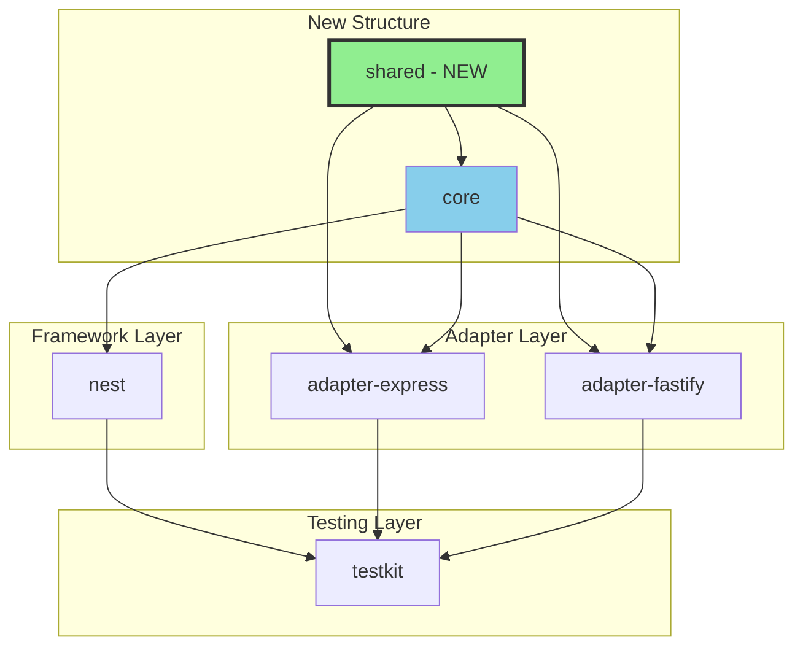
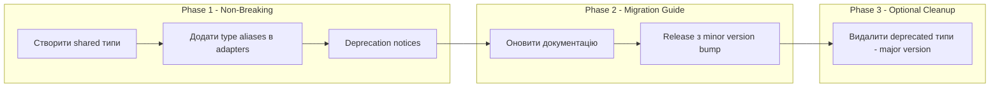
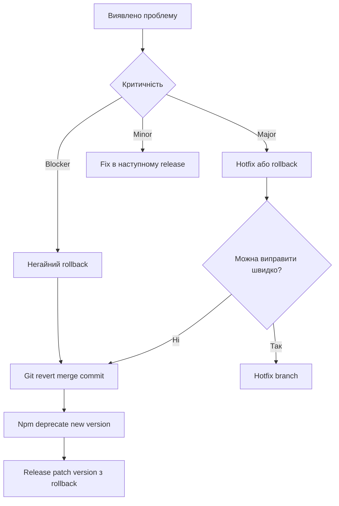

# План впровадження покращень nestjs-request-context

**Дата створення:** 2025-01-XX  
**Версія документу:** 1.0  
**На основі аналізу:** `plans/architecture-analysis-v2.md`

---

## 1. Огляд змін

### 1.1 Мета впровадження

Зменшити дублювання коду між adapter packages з ~60% до <10%, покращити type safety та maintainability проекту без breaking changes для існуючих користувачів.

### 1.2 Ключові зміни

| ID | Зміна | Пріоритет | Пакет | Breaking |
|----|-------|-----------|-------|----------|
| CH-01 | Створення `packages/shared` для спільних типів | HIGH | New | No |
| CH-02 | Кастомний `KeyExistsError` клас | HIGH | core | No |
| CH-03 | Factory для interceptor'ів | HIGH | shared | No |
| CH-04 | Валідація ContextKey імен | MEDIUM | core | No |
| CH-05 | Виправлення type assertion в Store.reset() | MEDIUM | core | No |
| CH-06 | Міграція adapter configs на shared типи | MEDIUM | adapters | No |

### 1.3 Діаграма залежностей після змін



---

## 2. Фаза 1: Підготовка (без breaking changes)

### 2.1 Створення структури `packages/shared`

#### 2.1.1 Створення директорії та базових файлів

**Структура пакету:**
```
packages/shared/
├── package.json
├── tsconfig.json
├── tsup.config.ts
├── vitest.config.ts
├── README.md
└── src/
    ├── index.ts
    ├── config.ts           # Спільні config типи
    ├── interceptor.ts      # Factory для interceptor'ів
    └── errors.ts          # Спільні error класи
```

**Завдання:**
- [ ] Створити директорію `packages/shared/`
- [ ] Створити `package.json` з іменем `@pas7/request-context-shared`
- [ ] Налаштувати `tsconfig.json` (наслідування від `tsconfig.base.json`)
- [ ] Налаштувати `tsup.config.ts` для ESM/CJS build
- [ ] Додати до workspace в `pnpm-workspace.yaml`

#### 2.1.2 Визначення спільних типів конфігурації

**Файл:** `packages/shared/src/config.ts`

```typescript
/**
 * Base configuration options for all request context adapters
 */
export interface RequestContextAdapterOptions {
  /**
   * The header name to read/write request ID from/to
   * @default 'x-request-id'
   */
  header?: string;

  /**
   * Custom function to generate request IDs
   * @default () => crypto.randomUUID()
   */
  idGenerator?: () => string;

  /**
   * Whether to add the request ID to the response headers
   * @default true
   */
  addResponseHeader?: boolean;
}

/**
 * Default values for adapter options
 */
export const DEFAULT_ADAPTER_OPTIONS = {
  header: 'x-request-id',
  addResponseHeader: true,
  idGenerator: () => crypto.randomUUID(),
} as const;
```

**Завдання:**
- [ ] Створити interface `RequestContextAdapterOptions`
- [ ] Створити `DEFAULT_ADAPTER_OPTIONS` constant
- [ ] Додати JSDoc документацію

### 2.2 Додавання кастомного Error класу

**Файл:** `packages/core/src/errors.ts` (додати)

```typescript
/**
 * Error thrown when attempting to set a key that already exists
 * with policy 'deny'
 */
export class KeyExistsError extends Error {
  constructor(public readonly key: string) {
    super(`Key "${key}" already exists in store`);
    this.name = 'KeyExistsError';
  }
}
```

**Завдання:**
- [ ] Додати `KeyExistsError` клас до `packages/core/src/errors.ts`
- [ ] Оновити експорт в `packages/core/src/index.ts`
- [ ] Додати unit тести для нового error класу

### 2.3 План міграції типів

#### 2.3.1 Стратегія міграції



#### 2.3.2 Type aliases в adapters (non-breaking)

**Файл:** `packages/adapter-express/src/config.ts`

```typescript
import type { RequestContextAdapterOptions } from '@pas7/request-context-shared';
import { DEFAULT_ADAPTER_OPTIONS } from '@pas7/request-context-shared';

/**
 * @deprecated Use RequestContextAdapterOptions from @pas7/request-context-shared
 */
export interface RequestContextExpressOptions extends RequestContextAdapterOptions {}

/**
 * @deprecated Use DEFAULT_ADAPTER_OPTIONS from @pas7/request-context-shared
 */
export const DEFAULT_EXPRESS_OPTIONS = DEFAULT_ADAPTER_OPTIONS;
```

**Завдання:**
- [ ] Оновити `packages/adapter-express/src/config.ts`
- [ ] Оновити `packages/adapter-fastify/src/config.ts`
- [ ] Додати `@pas7/request-context-shared` до dependencies

---

## 3. Фаза 2: Рефакторинг core

### 3.1 Покращення обробки помилок

#### 3.1.1 Зміни в Store

**Файл:** `packages/core/src/store.ts:31-36`

**До:**
```typescript
if (key in this._store) {
  switch (policy) {
    case 'deny':
      throw new Error(`Key "${key}" already exists in store`);
```

**Після:**
```typescript
import { KeyExistsError } from './errors.js';

// ...
if (key in this._store) {
  switch (policy) {
    case 'deny':
      throw new KeyExistsError(key);
```

**Завдання:**
- [ ] Оновити `Store.set()` для використання `KeyExistsError`
- [ ] Оновити тести

#### 3.1.2 Зміни в API

**Файл:** `packages/core/src/api.ts:52-62`

**До:**
```typescript
export function set<T>(key: ContextKey<T>, value: T, policy: SetPolicy = 'overwrite'): void {
  const context = getCurrentContext();
  try {
    context.set(key, value, policy);
  } catch (error) {
    if (error instanceof Error && error.message.includes('already exists')) {
      throw new ContextKeyCollisionError(key.name);
    }
    throw error;
  }
}
```

**Після:**
```typescript
import { KeyExistsError, ContextKeyCollisionError } from './errors.js';

export function set<T>(key: ContextKey<T>, value: T, policy: SetPolicy = 'overwrite'): void {
  const context = getCurrentContext();
  try {
    context.set(key, value, policy);
  } catch (error) {
    if (error instanceof KeyExistsError) {
      throw new ContextKeyCollisionError(key.name);
    }
    throw error;
  }
}
```

**Завдання:**
- [ ] Замінити string matching на `instanceof KeyExistsError`
- [ ] Оновити тести для перевірки нового behavior

### 3.2 Виправлення type issues

#### 3.2.1 Store.reset() - варіант з private reassignment

**Файл:** `packages/core/src/store.ts:89-92`

**Проблема:** Type assertion `(this as { _store: ... })._store` для обходу readonly

**Рішення:** Зробити `_store` не readonly, оскільки reset є легітимною операцією

**До:**
```typescript
export class Store {
  private readonly _store: Record<string, unknown>;
```

**Після:**
```typescript
export class Store {
  private _store: Record<string, unknown>;
  
  // ...
  
  reset(data: Record<string, unknown> = {}): void {
    this._store = createEmptyStore();
    Object.assign(this._store, data);
  }

  clear(): void {
    this._store = createEmptyStore();
  }
}
```

**Завдання:**
- [ ] Видалити `readonly` з `_store` declaration
- [ ] Видалити type assertions в `reset()` та `clear()`
- [ ] Оновити тести

#### 3.2.2 ContextKey - видалення невикористаного `_type`

**Файл:** `packages/core/src/contracts.ts:9-17`

**До:**
```typescript
export class ContextKey<T = unknown> {
  readonly name: string;
  readonly _type?: T;  // Never used

  constructor(name: string) {
    this.name = name;
  }
}
```

**Після (Option A - видалити):**
```typescript
export class ContextKey<T = unknown> {
  readonly name: string;
  // T is phantom type parameter for compile-time type safety only

  constructor(name: string) {
    this.name = name;
  }
}
```

**Після (Option B - private phantom field):**
```typescript
export class ContextKey<T = unknown> {
  readonly name: string;
  // Phantom type parameter for compile-time type safety
  private readonly __phantom?: T;

  constructor(name: string) {
    this.name = name;
  }
}
```

**Рекомендація:** Option A - просто видалити поле, оскільки воно не несе жодної функції.

**Завдання:**
- [ ] Видалити `_type` поле з ContextKey
- [ ] Оновити JSDoc коментар про phantom type
- [ ] Перевірити, що тести проходять

### 3.3 Додавання валідації

#### 3.3.1 Валідація ContextKey імен

**Файл:** `packages/core/src/contracts.ts`

```typescript
export class ContextKey<T = unknown> {
  readonly name: string;

  constructor(name: string) {
    if (typeof name !== 'string' || name.trim() === '') {
      throw new Error('ContextKey name must be a non-empty string');
    }
    if (name === '__proto__' || name === 'constructor' || name === 'prototype') {
      throw new Error(`ContextKey name "${name}" is reserved and cannot be used`);
    }
    this.name = name;
  }
}
```

**Завдання:**
- [ ] Додати валідацію в конструктор ContextKey
- [ ] Створити error клас `InvalidContextKeyError` (опціонально)
- [ ] Додати тести для validation logic

---

## 4. Фаза 3: Уніфікація adapters

### 4.1 Створення спільних типів

**Вже виконано в Фазі 1** - `RequestContextAdapterOptions` в `packages/shared`

### 4.2 Factory для interceptor'ів

#### 4.2.1 Створення factory function

**Файл:** `packages/shared/src/interceptor.ts`

```typescript
import type { NestInterceptor, ExecutionContext, CallHandler } from '@nestjs/common';
import { Injectable } from '@nestjs/common';
import type { Observable } from 'rxjs';
import { run } from '@pas7/request-context-core';
import type { RequestContextAdapterOptions } from './config.js';
import { DEFAULT_ADAPTER_OPTIONS } from './config.js';

/**
 * Factory function to create a NestJS interceptor for request context
 * @param options - Configuration options
 * @returns A NestJS interceptor class
 */
export function createRequestContextInterceptor(
  options?: RequestContextAdapterOptions
): new () => NestInterceptor {
  // Pre-resolve options to avoid allocations in hot path
  const headerName = options?.header ?? DEFAULT_ADAPTER_OPTIONS.header;
  const idGenerator = options?.idGenerator ?? DEFAULT_ADAPTER_OPTIONS.idGenerator;

  @Injectable()
  class RequestContextInterceptor implements NestInterceptor {
    intercept(context: ExecutionContext, next: CallHandler): Observable<unknown> {
      const httpContext = context.switchToHttp();
      const request = httpContext.getRequest<{ headers: Record<string, string | undefined> }>();

      const requestId = request.headers[headerName] ?? idGenerator();

      return run({ requestId }, () => next.handle());
    }
  }

  return RequestContextInterceptor;
}
```

**Завдання:**
- [ ] Створити `packages/shared/src/interceptor.ts`
- [ ] Додати `@nestjs/common` та `rxjs` як peerDependencies
- [ ] Додати unit тести

#### 4.2.2 Оновлення adapter-express

**Файл:** `packages/adapter-express/src/nest-interceptor.ts`

```typescript
import { createRequestContextInterceptor } from '@pas7/request-context-shared';
import type { RequestContextExpressOptions } from './config.js';

/**
 * @deprecated Use createRequestContextInterceptor from @pas7/request-context-shared
 */
export function UseRequestContextExpress(
  options?: RequestContextExpressOptions
): new () => NestInterceptor {
  return createRequestContextInterceptor(options);
}
```

**Завдання:**
- [ ] Рефакторинг `UseRequestContextExpress` для використання factory
- [ ] Зберегти backward compatibility
- [ ] Оновити тести

#### 4.2.3 Оновлення adapter-fastify

**Файл:** `packages/adapter-fastify/src/nest-interceptor.ts`

```typescript
import { createRequestContextInterceptor } from '@pas7/request-context-shared';
import type { RequestContextFastifyOptions } from './config.js';

/**
 * @deprecated Use createRequestContextInterceptor from @pas7/request-context-shared
 */
export function UseRequestContextFastify(
  options?: RequestContextFastifyOptions
): new () => NestInterceptor {
  return createRequestContextInterceptor(options);
}
```

**Завдання:**
- [ ] Рефакторинг `UseRequestContextFastify` для використання factory
- [ ] Зберегти backward compatibility
- [ ] Оновити тести

### 4.3 Тестування сумісності

#### 4.3.1 Тестові сценарії

| Сценарій | Опис | Статус |
|----------|------|--------|
| TC-01 | Express interceptor з default options | Existing |
| TC-02 | Fastify interceptor з default options | Existing |
| TC-03 | Express interceptor з custom header | Existing |
| TC-04 | Fastify interceptor з custom header | Existing |
| TC-05 | New: Factory interceptor з Express mock | New |
| TC-06 | New: Factory interceptor з Fastify mock | New |
| TC-07 | New: Shared config types compatibility | New |

**Завдання:**
- [ ] Додати integration тести для factory
- [ ] Перевірити, що всі існуючі тести проходять
- [ ] Додати тести для shared package

---

## 5. Оцінка зусиль

### 5.1 Матриця складності

| Задача | Складність | Ризик | Коментар |
|--------|------------|-------|----------|
| CH-01: Створення shared package | Low | Low | Стандартна структура |
| CH-02: KeyExistsError клас | Low | Low | Проста зміна |
| CH-03: Factory для interceptor'ів | Medium | Low | Потрібні тести |
| CH-04: Валідація ContextKey | Low | Medium | Може вплинути на існуючий код |
| CH-05: Store.reset() fix | Low | Low | Internal change |
| CH-06: Міграція configs | Medium | Low | Backward compatible |

### 5.2 Категоризація зусиль

| Категорія | Опис |
|-----------|------|
| **Low** | Зміни в одному файлі, < 50 рядків, очевидний результат |
| **Medium** | Зміни в 2-3 файлах, 50-150 рядків, потребують тестування |
| **High** | Зміни в 4+ файлах, > 150 рядків, потребують ретельного тестування |

### 5.3 Загальна оцінка

| Фаза | Кількість задач | Складність |
|------|-----------------|------------|
| Фаза 1: Підготовка | 6 tasks | Low-Medium |
| Фаза 2: Core рефакторинг | 5 tasks | Low-Medium |
| Фаза 3: Adapter уніфікація | 5 tasks | Medium |
| **Всього** | **16 tasks** | **Medium** |

---

## 6. Тест-план

### 6.1 Нові тести

#### 6.1.1 Shared package tests

**Файл:** `packages/shared/src/config.test.ts`
- Перевірка DEFAULT_ADAPTER_OPTIONS values
- Type compatibility з adapter options

**Файл:** `packages/shared/src/interceptor.test.ts`
- Factory створює правильний interceptor
- Options resolution (default vs custom)
- Header extraction logic
- ID generation logic

#### 6.1.2 Core package tests (додаткові)

**Файл:** `packages/core/src/errors.test.ts`
- KeyExistsError constructor
- Error message format

**Файл:** `packages/core/src/contracts.test.ts`
- ContextKey валідація: пусті імена
- ContextKey валідація: reserved words
- ContextKey валідація: валідні імена

### 6.2 Regression testing

#### 6.2.1 Existing test suites для перевірки

| Package | Test Files | Tests Count |
|---------|------------|-------------|
| core | 8 files | ~100 tests |
| adapter-express | 4 files | ~60 tests |
| adapter-fastify | 4 files | ~60 tests |
| nest | 7 files | ~80 tests |
| testkit | 5 files | ~30 tests |

#### 6.2.2 Стратегія regression testing

1. **Pre-commit:** Запуск всіх тестів локально
2. **CI Pipeline:** Повний test suite на всіх Node.js версіях (18, 20, 22)
3. **E2E:** Integration тести з real NestJS додатками

### 6.3 Test coverage goals

| Package | Current | Target |
|---------|---------|--------|
| core | ~95% | 95%+ |
| shared | N/A | 95%+ |
| adapter-express | ~90% | 90%+ |
| adapter-fastify | ~90% | 90%+ |
| nest | ~90% | 90%+ |

---

## 7. Rollback план

### 7.1 Стратегія відкату



### 7.2 Git strategy

```bash
# Створення backup branch перед змінами
git checkout -b backup/pre-refactoring-main
git push origin backup/pre-refactoring-main

# Rollback якщо потрібен
git revert <merge-commit-hash>
git push origin main

# Або повний rollback
git reset --hard backup/pre-refactoring-main
git push --force origin main  # З обережністю!
```

### 7.3 Npm versioning strategy

| Зміна | Version | Rollback |
|-------|---------|----------|
| New shared package | 0.4.0 | Не публікувати або deprecate |
| Core changes | 0.4.0 | Git revert + 0.4.1 |
| Adapter changes | 0.4.0 | Git revert + 0.4.1 |

### 7.4 Feature flags

**Не потрібні** для даного впровадження, оскільки:
1. Всі зміни backward compatible
2. Немає behavior changes для end users
3. Внутрішній рефакторинг без API змін

Якщо виникне потреба, можна додати:

```typescript
// Опціональний feature flag для нової валідації
const VALIDATE_CONTEXT_KEYS = process.env.REQUEST_CONTEXT_VALIDATE_KEYS !== 'false';

if (VALIDATE_CONTEXT_KEYS && reservedNames.includes(name)) {
  throw new Error(`ContextKey name "${name}" is reserved`);
}
```

---

## 8. Чек-лист впровадження

### 8.1 Pre-implementation

- [ ] Створити git branch `feature/shared-package`
- [ ] Створити backup branch
- [ ] Переконатися, що всі тести проходять на main

### 8.2 Фаза 1

- [ ] Створити `packages/shared` структуру
- [ ] Реалізувати `RequestContextAdapterOptions`
- [ ] Реалізувати `DEFAULT_ADAPTER_OPTIONS`
- [ ] Додати `KeyExistsError` в core
- [ ] Додати тести для shared package
- [ ] Запустити всі тести

### 8.3 Фаза 2

- [ ] Оновити `Store.set()` з `KeyExistsError`
- [ ] Оновити `api.ts` з `instanceof` check
- [ ] Видалити `readonly` з `_store`
- [ ] Видалити `_type` з `ContextKey`
- [ ] Додати валідацію ContextKey
- [ ] Запустити всі тести

### 8.4 Фаза 3

- [ ] Створити `createRequestContextInterceptor` factory
- [ ] Оновити `adapter-express/nest-interceptor.ts`
- [ ] Оновити `adapter-fastify/nest-interceptor.ts`
- [ ] Додати type aliases для backward compatibility
- [ ] Запустити всі тести

### 8.5 Pre-release

- [ ] Оновити CHANGELOG.md
- [ ] Оновити README.md з новими imports
- [ ] Запустити full test suite на всіх Node versions
- [ ] Створити changeset для version bump
- [ ] Code review

### 8.6 Release

- [ ] Merge PR до main
- [ ] CI проходить успішно
- [ ] Version bump (0.4.0)
- [ ] Publish to npm
- [ ] Створити git tag

---

## 9. Ризики та мітигація

| Ризик | Імовірність | Вплив | Мітигація |
|-------|-------------|-------|-----------|
| Breaking change в API | Low | High | Backward compatible type aliases |
| Тести не проходять | Medium | Medium | Поетапне впровадження з тестуванням |
| Circular dependencies | Low | Medium | Правильна структура imports |
| Performance regression | Low | Low | Benchmark testing |
| Documentation outdated | Medium | Low | Оновити README одночасно з кодом |

---

## 10. Підсумок

### 10.1 Очікувані результати

- ✅ Зменшення дублювання коду з ~60% до <10%
- ✅ Покращення type safety (видалення type assertions)
- ✅ Надійніша обробка помилок (instanceof замість string matching)
- ✅ Краща maintainability через централізовані типи
- ✅ Zero breaking changes для існуючих користувачів

### 10.2 Наступні кроки після впровадження

1. Моніторинг GitHub Issues для feedback
2. Збір feedback від користувачів
3. Планування Phase 4 (optional cleanup в major version)
4. Документація best practices для нових adapters

---

*План створено Architect Mode*
